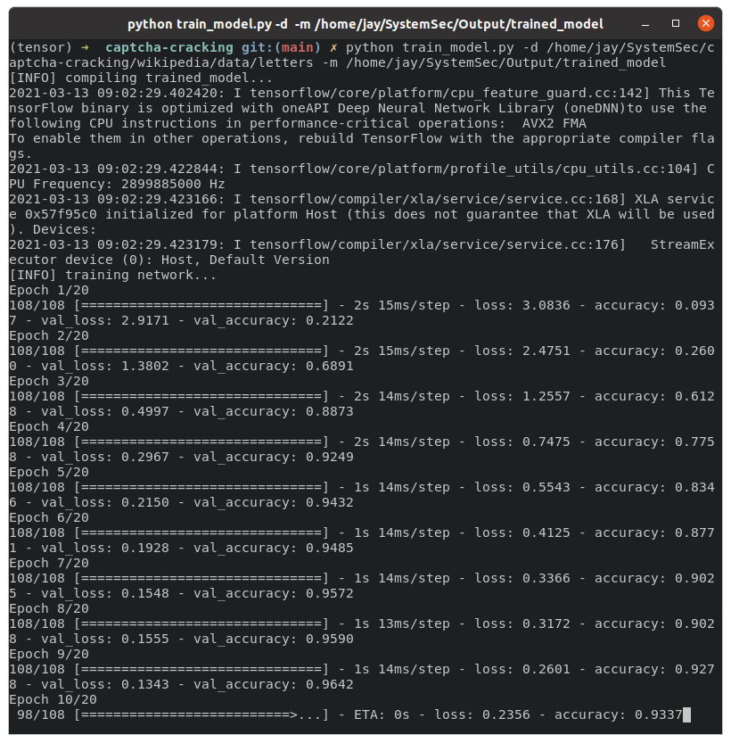
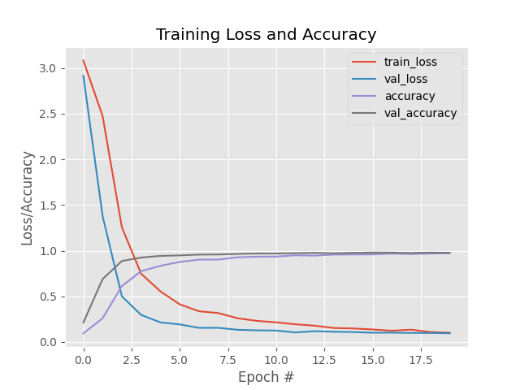
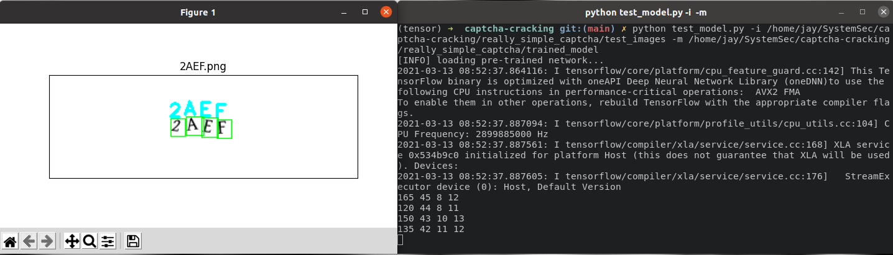
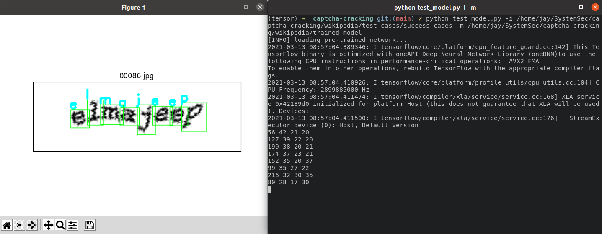

# Cracking CAPTCHAs

## Table of contents

- [Quick start](#quick-start)
- [What's included](#whats-included)
- [How to use](#how-to-use)
- [Screenshot](#screenshot)
- [Creators](#creators)
- [References](#references)

## Quick start

This tool has been tested on Ubuntu 20.04 / Intel(R) Core(TM) i5-10400F CPU @ 2.90GHz 

### Installation requirement
- Essentials:

    ```sudo apt-get install build-essential cmake unzip pkg-config```
- X-windows libraries + openGL:

    ```sudo apt-get install libxmu-dev libxi-dev libglu1-mesa libglu1-mesa-dev```
- Image + video I/O libraries:

    ```sudo apt-get install libjpeg-dev libpng-dev libtiff-dev libavcodec-dev libavformat-dev libswscale-dev libv4l-dev libxvidcore-dev libx264-dev```
- Optimization libaries:

    ```sudo apt-get install libopenblas-dev libatlas-base-dev liblapack-dev gfortran```
- Large dataset:

    ```sudo apt-get install libhdf5-serial-dev```
- Python3-related:

    ```sudo apt-get install python3-dev python3-tk python-imaging-tk libgtk-3-dev```

#### NVIDIA

- Graphics Driver:<br>
        ```sudo add-apt-repository ppa:graphics-drivers/ppa```<br>
        ```sudo apt-get install nvidia-driver-4xx```<br>
        ```sudo reboot now```<br>
        **Verify using the command ```nvidia-smi``` on the terminal**
- CUDA:
        obtain the latest CUDA from here: ```https://developer.nvidia.com/cuda-downloads?target_os=Linux```<br>
        `chmod +x cuda_*_linux.run`<br>
        `sudo ./cuda_*.run --silent --toolkit --override`<br>
        modify your shell script (e.g., `.bashrc`) to include these two paths and then ```source bashrc```:<br>
            1. ```export PATH=/usr/local/cuda-xx.x/bin:$PATH```<br>
            2. ```export LD_LIBRARY_PATH=/usr/local/cuda-xx.x/lib64```<br>
        **Verify using the command ```nvcc -V``` on the terminal**
- cuDNN:
        obtain the latest cuDNN from here ```https://developer.nvidia.com/rdp/cudnn-download```<br>
        ```tar -zxf cudnn-*.tgz```<br>
        ```cd cuda```<br>
        ```sudo cp -P lib64/* /usr/local/cuda/lib64/```<br>
        ```sudo cp -P include/* /usr/local/cuda/include/```<br>


#### Virtualenv
- We **highly** recommend you setup virtual environment to work to not mess up any `python` packages on your main system (you may skip this part if needed)     
     ```pip3 install virtualenv virtualenvwrapper```<br>
    modify your shell script (e.g., `.bashrc`) to include these two paths and then ```source bashrc```:<br>
        1. ```export WORKON_HOME=$HOME/.local/bin/.virtualenvs ```<br>
        2. ```export VIRTUALENVWRAPPER_PYTHON=/usr/bin/python3```<br>
        3. ```export VIRTUALENVWRAPPER_VIRTUALENV=$HOME/.local/bin/virtualenv```<br>
        4. ```source $HOME/.local/bin/virtualenvwrapper.sh```<br>
    afterwards, create your virtualenv using the command: ```mkvirtualenv desired_name -p python3```<br>
    use your virtualenv using the command: ```workon desired_name```<br>
    leave virtualenv using the command: ```deactivate```<br>

#### TensorFlow
- Use ```tensorflow-gpu``` if your system is using NVIDIA graphics card <br>
    ```pip install numpy``` <br>
    ```pip install tensorflow``` or ```tensorflow-gpu```<br>
    ```pip install opencv-contrib-python```<br>
    ```pip install scikit-image```<br>
    ```pip install pillow```<br>
    ```pip install imutils```<br>
    ```pip install scikit-learn```<br>
    ```pip install matplotlib```<br>

- To test everything, please run the following code:<br>
    ```$HOME: workon desired_name```<br>
    ```$HOME: python```<br>
        * ```> import tensorflow as tf```<br>
        * ```> tf.test.is_gpu_available()```<br>
    ```$HOME: True```<br>

## What's included
```
.
├── really_simple_captcha/
│   ├── test_images/
│   └── trained_model/
├── wikipedia/
│   ├── data/
│   │   ├── letters/
│   │   └── training_images/
│   │── test_cases/
│   │   ├── failure_cases/
│   │   │── success_cases/
│   │   └── test_images/
│   └── trained_model/
├── JSoup/
│   └── App.java 
│── dataset.py
│── helpers.py
│── lenet.py
│── test_model.py
└── train_model.py
```

## How to use

### To download Wikipedia images
run ```App.java```

### To train the models
```usage: train_model.py [-h] -d DATASET -m TRAINED_MODEL```

### To test the models
```usage: test_model.py [-h] -i INPUT -m TRAINED_MODEL```

#### ctrl+C to leave anytime during the application

## Screenshot

### Training 
  
<br>
### Testing



## Creators
- Jae-Won Jang [https://github.com/jjang3]
- Gokce Onen [https://github.com/owlswollen/]

## References
---
#### Rosebrock, A. (2017) *Deep Learning for Computer Vision with Python: Starter Bundle*. PyImageSearch. https://books.google.com/books?id=9Ul-tgEACAAJ
#### How to break a CAPTCHA system in 15 minutes with Machine Learning. https://medium.com/@ageitgey/how-to-break-a-captcha-system-in-15-minutes-with-machine-learning-dbebb035a710
---